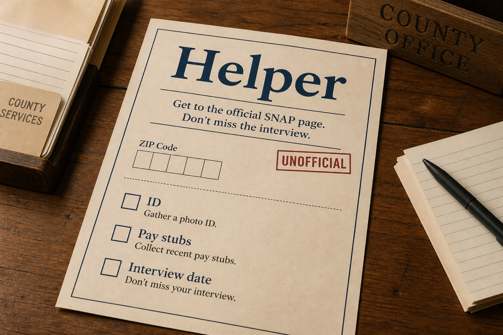
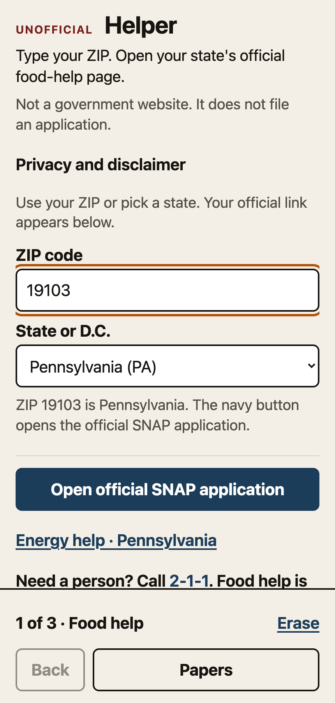
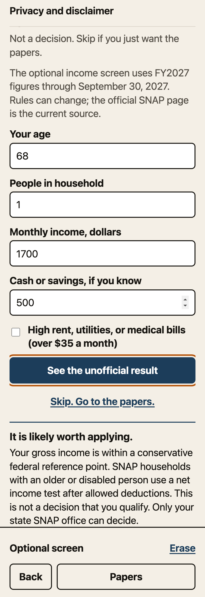

# Helper



Live site: https://baney75.github.io/helper/

Built with TypeScript and Vite.

Helper helps someone 60 or older find an official state SNAP page, prepare a papers list, and keep an interview or recertification date. It has no account and does not send answers to a server.

This is not a government website. It does not decide a case and does not file an application. If it conflicts with an agency notice or worker, follow the agency.

<p>
  
  
</p>

Screenshots come from `npm run build && npx vite preview` at a 430 px wide viewport, taken with Playwright on October 10, 2026.

## The three steps

1. Enter a ZIP or pick a state, then open the official SNAP destination.
2. Print the papers checklist. Bring what you have.
3. Save, change, remove, or download the interview, recertification, or energy-help date.

SNAP is open year-round. Energy programs are seasonal and funds can run out. The optional income screen uses FNS figures for FY2027 (October 1, 2026 through September 30, 2027); it pauses on any date no table covers.

**Data is current through September 30, 2027** (SNAP income standards, FY2027). State links were last checked September 7, 2026.

Progress saves in this browser on this device. If the internet drops, the packet and saved date still work; official state pages need the internet. On a shared computer or phone, use Erase this device before handing it to someone else. A new version waits for a person to choose Reload, so the current page does not mix old and new assets.

## Why this exists

USDA reported that SNAP participation in FY2022 was 55% among eligible people 60 and older, compared with 88% overall. Helper cannot submit an application, but it can get someone to an official page, make a paper list, and keep a date from getting lost. The source is listed in `research/SOURCES.md`.

LIHEAP is a block grant. States set the rules and funds can run out. Meeting an income cutoff does not mean someone will receive help.

## Run and check

```bash
npm install
npm test
npm run typecheck
npm run build
npm run dev
```

Open the URL Vite prints. The production build assumes GitHub Pages at `/helper/`.

## Data

State links live in `src/data/programs.ts`; each row has a `checkedOn` date. SNAP income tables for FY2026 and FY2027 (through 30 Sep 2027) live in `src/data/fpl.ts`. Sources and the update policy are in `research/SOURCES.md`.

A weekly GitHub Actions job (`.github/workflows/table-expiry.yml`) fails when the newest table ends within 30 days. Run it locally with `node scripts/check-table-expiry.mjs`.

If a portal is down, keep the official how-to page. Do not invent URLs. Screening copy may say `likely_worth_applying` or `maybe`. It must not say eligible or ineligible.

## Check the two demos

- `19103` opens Pennsylvania's COMPASS SNAP application and the official Pennsylvania LIHEAP information page.
- `90210` opens California's BenefitsCal SNAP application and the California LIHEAP information page.

For either demo, print the packet, save a date, reload, edit it, then remove it. Test the state picker and an invalid ZIP too.

## License

MIT. See `LICENSE`.

If this saved you a trip:
https://buymeacoffee.com/baneydonovan
